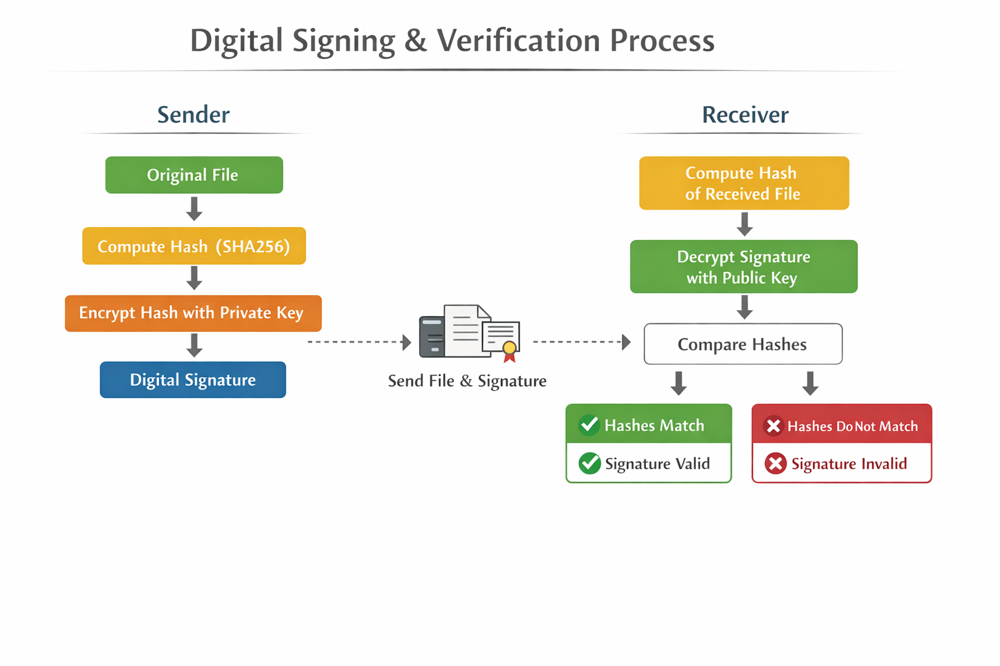

# RSA Digital Signing Tool

A **Python CLI tool** for digital signing and verification using RSA asymmetric encryption.

---

## Features
- Generate RSA public/private key pair
- Sign any file with your private key
- Verify a file's signature with a public key
- Example files included for quick testing

---


## Digital Signing & Verification Process

<p align="center">
  
</p>
## Installation


1. Clone the repository:

```bash
git clone https://github.com/pavanikrishnadola/RSA-Digital-SigUp.git
cd RSA-Digital-SigUp

